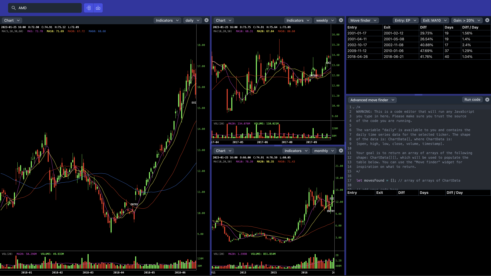

# Chart Study Tool

The Chart Study tool, by [base.report](https://base.report), is a web-based application for analyzing stock charts.

**Warning**: It is currently in alpha stage and may contain bugs or unfinished features.

## Features

- A frame that starts with a single pane and can be split to the right or to the bottom.
- Each pane can hold a widget, including a stock chart, move finder, and advanced mover finder (with embedded code editor).
- Customization options to personalize the user experience.



## Usage

For a quick start guide on how to use the tool, please watch the following video tutorial.

[](https://www.youtube.com/watch?v=zhncPj3sTYo)

## Get started

[Financial Modeling Prep](https://site.financialmodelingprep.com/developer) is used as the data provider. You can obtain an API key from their website.

Following are instructions for installing the Chart Study tool locally and on Vercel.

### Local

#### Prerequisites

- [pNpm](https://pnpm.io)

#### Setup environment variables

Create a `.env` file and add the following content. You need to fill in `SECRET_FMP_API_KEY` value with your own API key.

```
SECRET_FMP_API_URL=https://financialmodelingprep.com/api
SECRET_FMP_API_KEY=
```

#### Install and run

```bash
pnpm install
pnpm run dev

# or start the server and open the app in a new browser tab
pnpm run dev -- --open
```

### Vercel

#### Prerequisites

- A [GitHub](https://github.com) account.
- A [Vercel](http://vercel.com) account that is linked with your GitHub account

#### Instructions

- Before setting it up on Vercel. Please note that the website will become accessible by anyone by default. If you want to protect the link, please visit: https://vercel.com/docs/concepts/deployments/deployment-protection.
- Fork this repo.
- Add your forked repo as a project on Vercel. You should be able to import the project using the default settings provided by Vercel. Please visit https://vercel.com/docs/concepts/projects/overview for more details.
- Set the environment variables (the same ones from above under Local). Please visit https://vercel.com/docs/concepts/projects/environment-variables for more details

## Feedback

We welcome feedback and bug reports. Please submit an issue or pull request on GitHub.

## Contributing

We welcome contributions to the Chart Study tool. Please submit pull requests and issues on GitHub. As the project is currently in alpha stage, there is no set standards yet except for semantic commit messages.

## Licensing

Chart Study tool is released under the MIT license. See the [LICENSE](LICENSE) file for more information.
